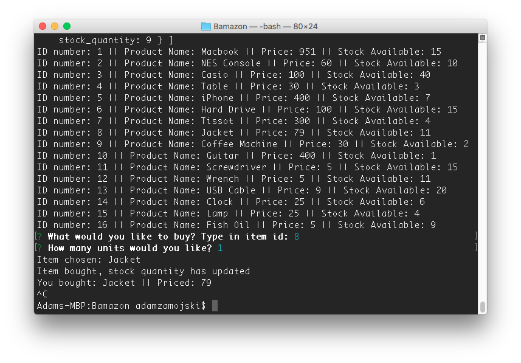
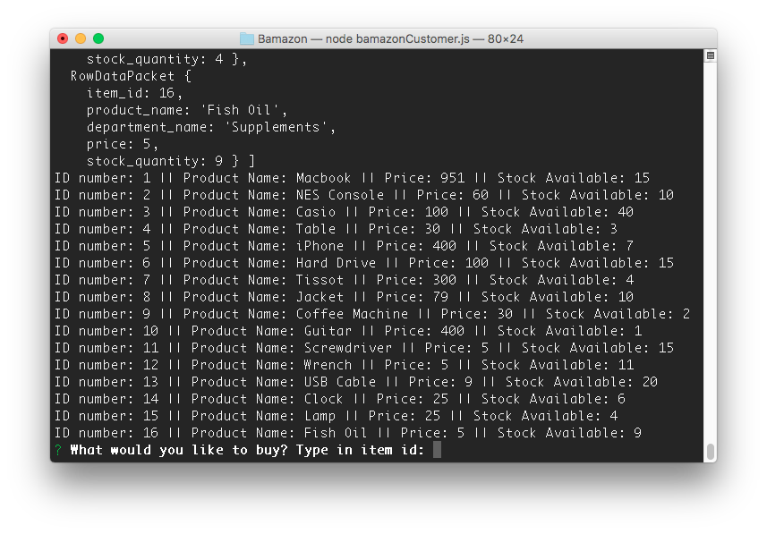

# Bamazon

## Description
There will be two files that run with node.js the first,
`bamazonCustomer.js`will allow the user to view a database
list of items with a choice to pick an item and the amount
of quantity to buy. The second, `bamazonManager.js` will the
user to view a database list of items, view items with low
inventory, add items to an inventory, and add a new product.

### BamazonCustomer
When launching this node app, the user will be prompted to
select the ID of an item to purchase and how many units to 
purchase. I chose 1 item to buy which will log the item bought
and the price of the item. Example: 
Running the app again will display the new stock quantity. 
Example: 
