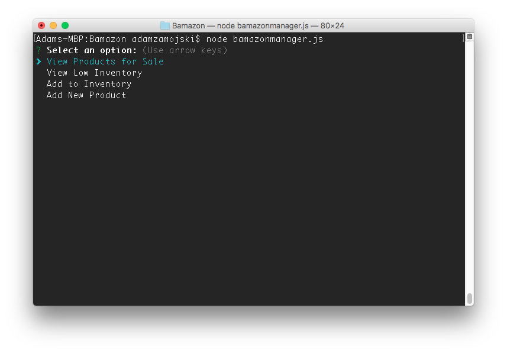
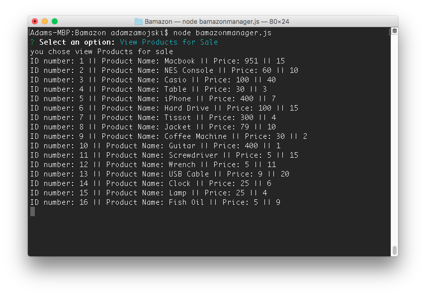
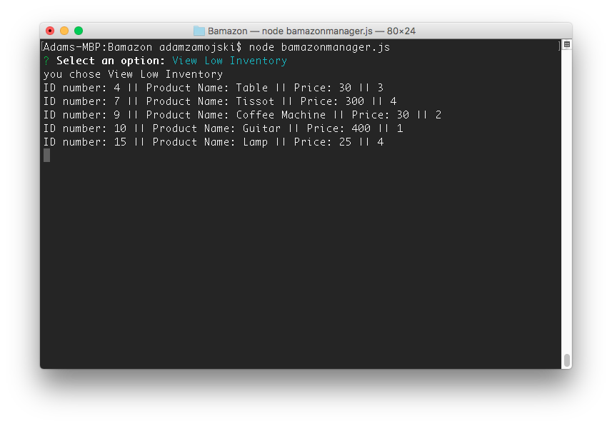
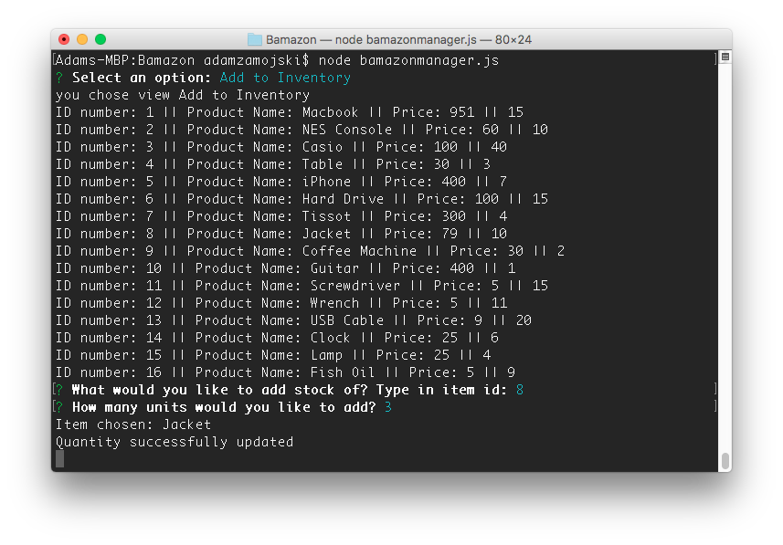
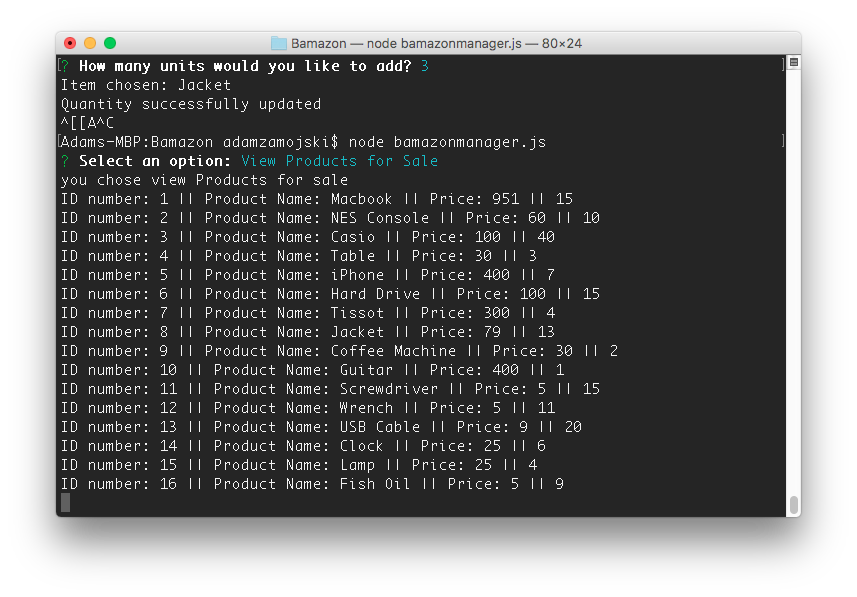
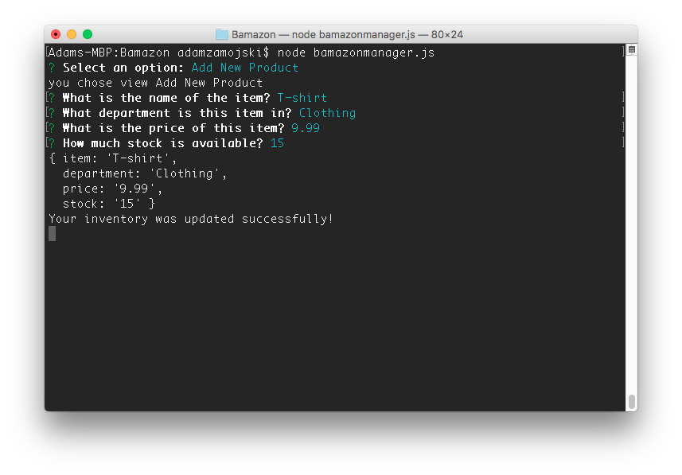
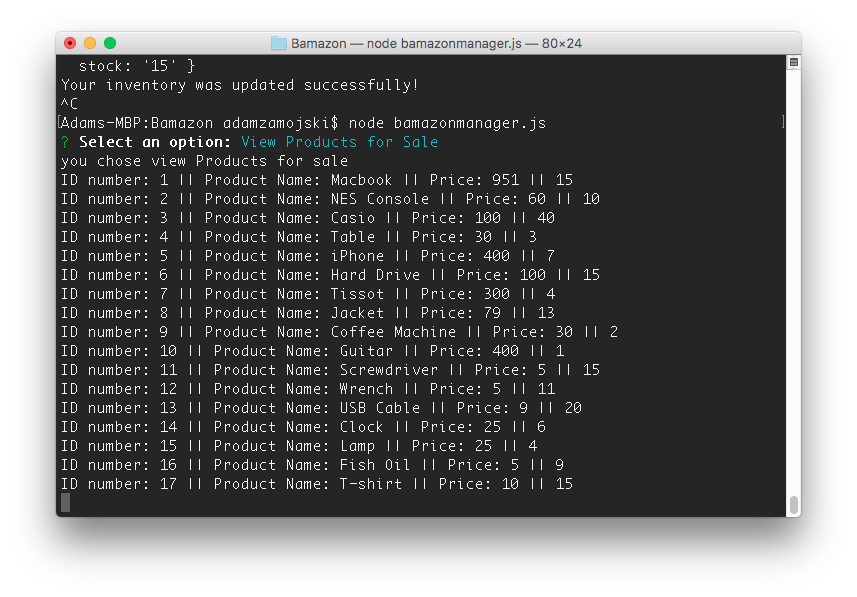

# Bamazon

## Description
There will be two files that run with node.js the first,
`bamazonCustomer.js`will allow the user to view a database
list of items with a choice to pick an item and the amount
of quantity to buy. The second, `bamazonManager.js` will the
user to view a database list of items, view items with low
inventory, add items to an inventory, and add a new product.

### BamazonCustomer
When launching this node app, the user will be prompted to
select the ID of an item to purchase and how many units to 
purchase. I chose 1 item to buy which will log the item bought
and the price of the item. Example: 
Running the app again will display the new stock quantity. 
Example: 

### BamazonManager
This is similar to the customer but with more options. First, 
when launching the app it will display 4 options,

When selecting the first option, `View Products for Sale`, it 
will list all the items 
The second option, `View Low Inventory` will display all the 
items with a stock quantity of less than 5. Example: 
 The third option, `Add to Inventory`
will allow the manager to select an item by ID and add
the desired stock amount. Example: 
Jacket’s stock when from 10 to 13. Example: 
Finally, the last option, `Add new Product` will prompt the manager to 
enter a new product to the database. Example: 
There is now a 17th ID number with T-shirt 
